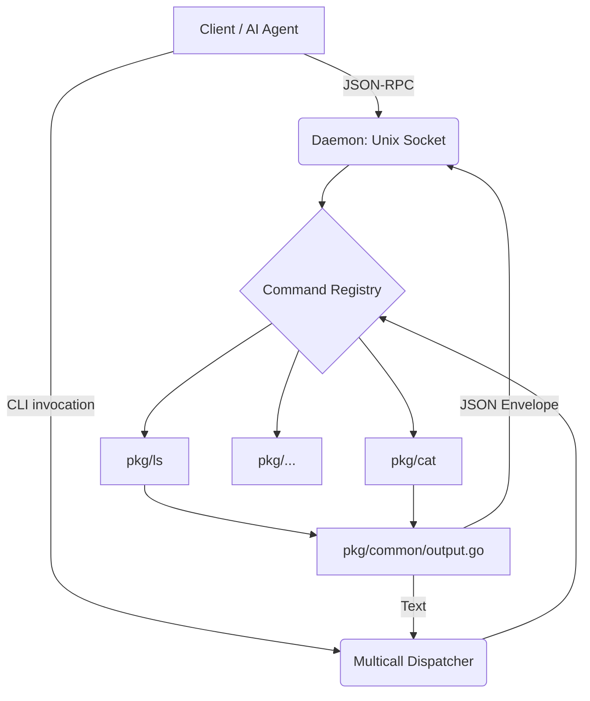

# System Architecture

KoreGo is a POSIX-compliant userland implemented as a single, statically-linked Go binary. It is designed to function both as a traditional command-line utility (multicall binary) and as an interactive, persistent JSON-RPC daemon for AI agents.

## Core Design Principles
1. **Zero External Dependencies**: Beyond the standard library and a lightweight shell interpreter (`mvdan.cc/sh`), KoreGo depends on nothing.
2. **Dual-Mode Execution**:
   - **CLI Mode**: Standard POSIX standard output.
   - **JSON Mode**: Executed via daemon or with `--json` flag, rendering outputs as structured JSON payloads.
3. **Container-Native**: Built to run as a non-root user (`korego:1000`) inside a `FROM scratch` Docker image.

## Component Flow

## Packages
- `cmd/korego`: Main entry point. Handles symlinks (`/bin/ls`) and flags.
- `internal/dispatch`: Utility registry.
- `internal/daemon`: JSON-RPC 2.0 persistent server.
- `internal/shell`: Sandbox for script execution (`mvdan.cc/sh`).
- `pkg/common`: Shared tools (flags parsing, security, limits).
- `pkg/*`: Individual POSIX utility implementations.
